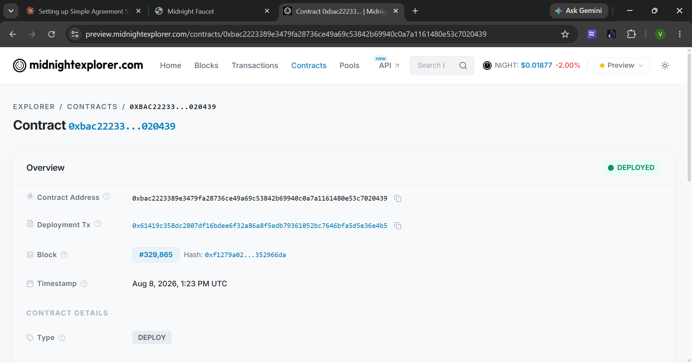
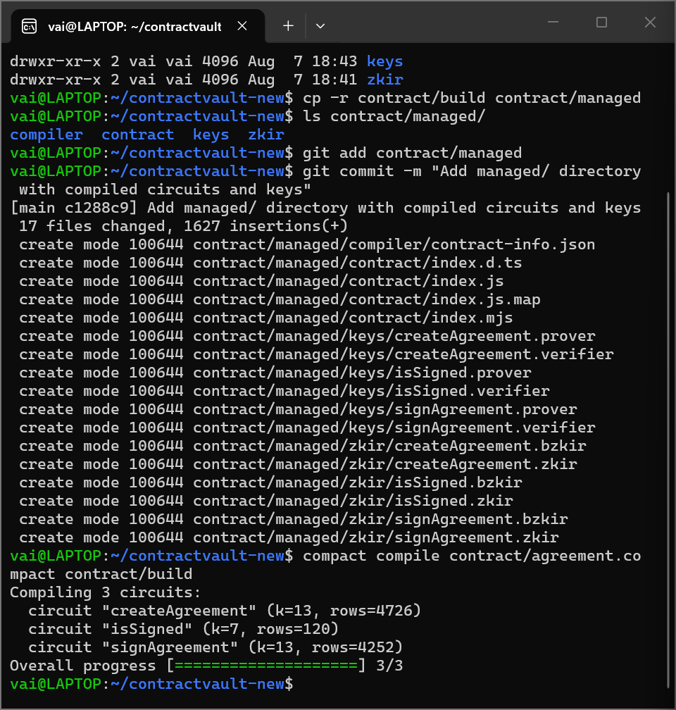
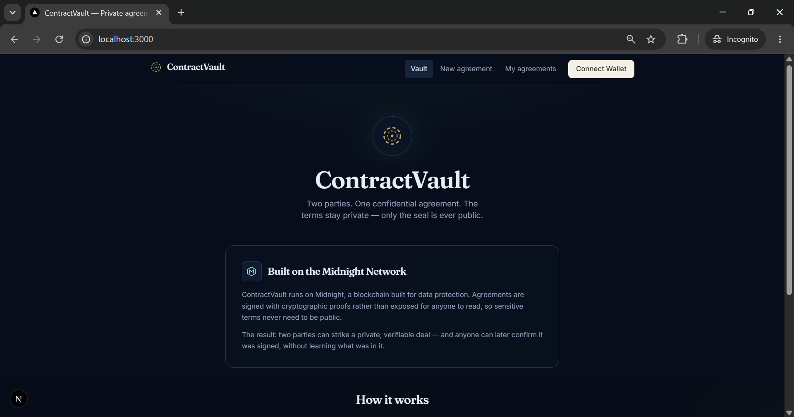
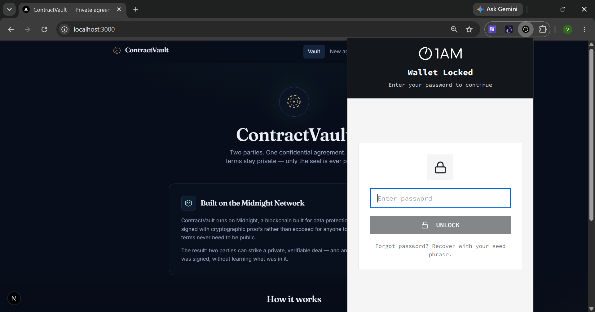
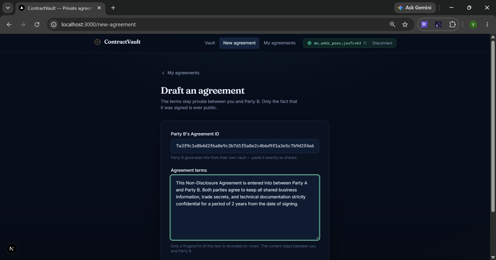
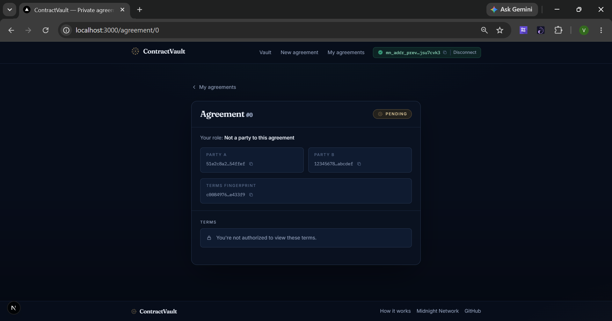
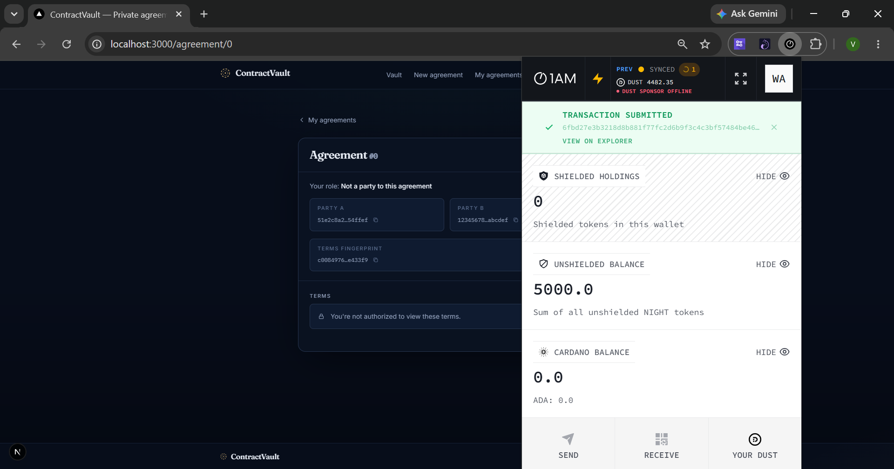

# ContractVault — Private Two-Party Agreement Signing

**Agree privately. Prove it publicly.**

ContractVault is a privacy-first decentralized application built on the Midnight Network that lets two people create and sign confidential agreements — NDAs, freelance contracts, private deals — without ever exposing the terms on-chain.

Instead of storing agreement text on the blockchain, ContractVault records only a cryptographic fingerprint of the terms. The actual content stays between the two parties. Anyone, anytime, can verify an agreement was signed, without ever seeing what it says.

## Initial Product Idea

Right now, when two people want proof they agreed to something, they either use paper contracts (easy to lose or dispute) or a fully public on-chain system (which exposes private business terms to anyone, including competitors). ContractVault lets two parties privately store an agreement and sign it on-chain — the content stays confidential forever, but the fact that a deal was made and signed can be proven at any time, by anyone, without revealing what was agreed to. This is useful for NDAs, freelance contracts, rental agreements, or any two-party arrangement where privacy of terms matters but proof of agreement still needs to be trustworthy and verifiable.

---

## Live Demo

- **Live site:** [contractvault-midnight.vercel.app](https://contractvault-midnight.vercel.app)
- **Demo video:** [Watch here](https://drive.google.com/file/d/1ypfY0VFVkpUA3Toj-vwsa_78pKeX1xAb/view?usp=sharing)

Note: the live site's proof server runs on Render's free tier, which spins down after periods of inactivity. The first transaction after idle time may take 30–60 seconds while it wakes up — this is expected, not an error.

The 1AM wallet's connection to the network can occasionally return an `InternalError` (a documented error code in the Midnight DApp Connector API, meaning the connector could not process the request internally on the wallet's side). This has been observed intermittently during development and is outside the application's control. If the live demo does not respond, please retry after a short wait, or refer to the demo video and the verified transaction below, both of which show the full create-and-sign flow succeeding end-to-end.As a mitigation, the application now automatically retries transient `InternalError` failures (up to 2 retries with a short delay) before surfacing an error to the user, which has significantly reduced how often this is encountered in practice.

---

## Live Deployment

- **Network:** Midnight Preview Testnet

  The public Midnight test network is referred to as "Preview" in current tooling and documentation. This project targets Preview rather than Preprod, based on the actual infrastructure and endpoints available at the time of building.

- **Deployed Contract Address:** `bac2223389e3479fa28736ce49a69c53842b69940c0a7a1161480e53c7020439`
- **Verified transaction (signAgreement):** [explorer.1am.xyz](https://explorer.1am.xyz/tx/8e7cf4bfbbf7f1629fe0a7b6028e86a690db9bb39343a5f20b2594c646f0dc16)
- **Wallet Integration:** 1AM Wallet



---

## Compile Output

Compiling 3 circuits:
circuit "createAgreement" (k=13, rows=4726)
circuit "isSigned" (k=7, rows=120)
circuit "signAgreement" (k=13, rows=4252)
Overall progress [====================] 3/3




---

## Screenshots

### Landing Page


### Wallet Connection (1AM Extension)


### Creating an Agreement


### Agreement Created


### Transaction Submitted


---

## Smart Contract

The contract is located at `contract/agreement.compact` and exposes three circuits:

- `createAgreement(partyBId, termsFingerprint)` — Party A creates a new agreement, specifying Party B and a fingerprint of the terms (not the terms themselves)
- `signAgreement(id)` — only the designated Party B can sign, transitioning status from Pending to Signed
- `isSigned(id)` — a public, callable check that returns signature status without revealing any agreement content

### Public State vs Private Witness

This contract deliberately separates what is public from what stays private, using Compact's `ledger` and `witness` constructs.

**Public ledger state** (visible to anyone on-chain):
- `agreements: Map<Uint<64>, Agreement>` — stores each agreement's Party A identifier, Party B identifier, a fingerprint of the terms, and its status (Pending/Signed)
- `nextId: Counter` — tracks agreement IDs

**Private witness** (never leaves the caller's device):
- `mySecretKey(): Bytes<32>` — a secret value known only to the caller, used to derive a public identity via a `persistentHash`-based circuit, without ever exposing the secret itself

The actual agreement terms are never passed into the contract at all — only a fingerprint (hash) of them is computed client-side and stored on-chain. This is a deliberate design: `disclose()` is used only on the fields meant to become public (the fingerprint, party identifiers, status) — the real terms text never touches the ledger, so there is nothing to leak even if the entire chain were inspected.

```compact
witness mySecretKey(): Bytes<32>;

circuit publicKey(sk: Bytes<32>): Bytes<32> {
  return persistentHash<Vector<2, Bytes<32>>>([pad(32, "agreement:pk"), sk]);
}

export circuit createAgreement(partyBId: Bytes<32>, termsFingerprint: Bytes<32>): [] {
  const myId = publicKey(mySecretKey());
  const id = nextId;
  agreements.insert(disclose(id), Agreement {
    partyA: disclose(myId),
    partyBId: disclose(partyBId),
    termsFingerprint: disclose(termsFingerprint),
    status: Status.PENDING
  });
  nextId.increment(1);
}
```

### Access Control: Who Can Sign

- **Party A (creator)** can never sign their own agreement — only view it and share the Agreement ID with Party B.
- **Party B** sees a sign option, but only while the agreement is Pending.
- Once signed, the option disappears for everyone — the agreement is sealed permanently.

```compact
export circuit signAgreement(id: Uint<64>): [] {
  const myId = publicKey(mySecretKey());
  const agreement = agreements.lookup(disclose(id));
  assert(agreement.partyBId == myId, "only Party B can sign this agreement");
  assert(agreement.status == Status.PENDING, "agreement is already signed");
  agreements.insert(disclose(id), Agreement {
    partyA: agreement.partyA,
    partyBId: agreement.partyBId,
    termsFingerprint: agreement.termsFingerprint,
    status: Status.SIGNED
  });
}
```

---

## Privacy Behavior: What Can Be Verified Publicly

This is the core privacy claim, and it can be independently verified by anyone, without any special access:

1. Open the verified transaction above at [explorer.1am.xyz](https://explorer.1am.xyz/tx/8e7cf4bfbbf7f1629fe0a7b6028e86a690db9bb39343a5f20b2594c646f0dc16).
2. The explorer confirms the `signAgreement()` circuit was called successfully, and shows the transaction hash, block number, and fees paid.
3. At no point does the explorer, or any other public viewer, ever see the agreement's actual terms — only the `termsFingerprint` (a hash) is present on-chain.
4. Anyone can also call `isSigned(id)` directly against the contract and receive a true/false answer, without needing to be Party A or Party B, and without the response ever containing the underlying terms.

This demonstrates the intended behavior: proof that an agreement exists and was signed is fully public, while the content of the agreement remains known only to the two parties involved.

---

## Features

- **Private terms, public proof** — only a fingerprint of the agreement is ever recorded on-chain; the text itself never touches the ledger
- **1AM Wallet integration** — connects a real wallet on Midnight Preview to establish a verifiable, persistent identity for signing
- **Role-based access** — only the designated Party B ever sees a sign option, and only while the agreement is Pending
- **Public verifiability** — anyone can check whether an agreement was signed, with zero visibility into its content
- **Agreement dashboard** — lists every agreement the connected wallet is part of, with role and status clearly labeled
- **Seal visual** — signed agreements are marked with a wax-seal treatment matching the app's identity

---

## Tech Stack

- **Frontend:** Next.js, TypeScript, Tailwind CSS
- **Smart Contract:** Compact (Midnight's ZK smart contract language)
- **Blockchain:** Midnight Network (Preview testnet)
- **Wallet:** 1AM Wallet (`dapp-connector-api`)
- **Proof Generation:** `midnightntwrk/proof-server:8.0.3` — local via Docker for development, and publicly hosted on Render for the live deployment
- **Key packages:** `@midnight-ntwrk/compact-js`, `@midnight-ntwrk/compact-runtime`, `@midnight-ntwrk/midnight-js-contracts`, `@midnight-ntwrk/ledger-v8`, `@midnight-ntwrk/wallet-sdk-facade`

---

## Architecture

Agreement terms (typed by Party A)

↓

Fingerprint computed client-side — terms never leave the browser

↓

Compact smart contract (`createAgreement`) — deployed on Midnight Preview

↓

On-chain: `agreements` map stores:
- `partyA`
- `partyB`
- `termsFingerprint`
- `status`

↓

Party B calls `signAgreement(id)` — identity checked via derived public key

↓

Status flips: `Pending` → `Signed`

↓

Anyone can call `isSigned(id)` to verify — without ever seeing the terms

---

## Getting Started

```bash
# Install dependencies
npm install

# Start the local proof server (Docker)
docker run -d --name proof-server -p 6300:6300 midnightntwrk/proof-server:8.0.3

# Run the app
npm run dev
```

Open the app, click Connect Wallet, make sure your 1AM wallet is on the Preview network with testnet funds (via faucet), then go to New Agreement to create your first private agreement.

By default, the app proxies proving requests to `http://127.0.0.1:6300`. To point it at a different proof server (for example, the hosted Render instance used in production), set the `PROOF_SERVER_URL` environment variable before running.

## Deploying the Contract

```bash
CONTRACTVAULT_SECRET=$(openssl rand -hex 32) npm run deploy
```

This generates a fresh wallet, funds it on Preview via the faucet, registers DUST (fee tokens) from the NIGHT balance, and submits the deployment transaction.

---

## Testing

`contract/agreement.test.ts` exercises the compiled contract's circuits directly against `compact-runtime`'s in-memory `CircuitContext` — no network, wallet, or proof server required. It covers:

- Creating an agreement and verifying the resulting ledger state (status `PENDING`, correct `partyA`/`partyB`/terms fingerprint)
- Signing by the correct Party B, verifying status flips to `SIGNED` and `isSigned` returns `true`
- Rejecting a second sign attempt on an already-signed agreement
- Rejecting a sign attempt from an unauthorized signer

Run it with:

```bash
npm test
```

## Engineering Notes

Getting the Compact contract's build output correctly wired into a TypeScript deploy script surfaced a real API quirk: `CompiledContract.make()` returns an object whose prototype carries `.pipe()`, but `withWitnesses()` and `withCompiledFileAssets()` are Effect-style dual combinators that spread the object into a plain value, dropping the prototype and with it `.pipe`. Fixed by switching to nested data-first calls (`withCompiledFileAssets(withWitnesses(make(...), witnesses), zkConfigPath)`) instead of chaining `.pipe(...)`.

Full end-to-end transaction submission directly through 1AM's own hosted proving service was initially blocked by an issue on 1AM's side, isolated through direct comparison against a local proof server:

1. 1AM's hosted proof service initially rejected valid proofs with `Custom error 115: InvalidProof`. Confirmed as a service-side compatibility issue, not a contract bug, by successfully proving the same circuits against a local proof server instead.
2. Rerouting the app's proving step to a local proof server (proxied through a same-origin API route) resolved this entirely — the contract's own proof now generates and verifies correctly.

For the production deployment, since a browser on the live site cannot reach a proof server running on a developer's own laptop, the same `midnightntwrk/proof-server:8.0.3` image was deployed as a public web service on Render. The app's proof proxy route reads its target from the `PROOF_SERVER_URL` environment variable, so the deployed frontend on Vercel points at this hosted proof server instead of `localhost`. This was confirmed working end-to-end: agreements can be created and signed directly from the live site, with real transactions verifiable on-chain.

A separate, related error was also observed during fee payment: `Custom error 170: InvalidDustSpendProof`. This proof is generated internally by the 1AM wallet itself for its DUST fee and is not routed through the application's own proof server; it appears to share the same underlying compatibility issue with 1AM's hosted proving path specifically, and did not affect the application's own circuits once local/hosted proving was used.

---

## Status

| Component | Status |
|---|---|
| Compact contract (compile) | Complete — 3/3 circuits |
| Frontend build and typecheck | Passing |
| Wallet integration (1AM) | Working |
| On-chain deployment | Live on Preview testnet |
| Agreement creation and signing (local proof server) | Working |
| Agreement creation and signing (live site, hosted proof server) | Working (verified) — 1AM's wallet connector intermittently returns InternalError; see Live Demo note |
| Public verification (`isSigned`) | Implemented |
| Contract logic tests (`npm test`) | Passing (3/3) |

---

## Project Structure

contract/
agreement.compact Compact smart contract source
build/ Compiled contract, proving/verifying keys
managed/ Compiled circuits and keys

scripts/
deploy.mts Deployment script

src/
app/
page.tsx Home / Vault
new-agreement/ Create agreement form
my-agreements/ Agreement list
agreement/[id]/ Agreement detail and sign
api/proof/ Proof server proxy route
api/zk/ ZK key material serving route
lib/
api.ts Application logic (create, sign, list)
contract.ts Contract client, wallet and proof provider wiring
wallet.ts 1AM wallet connection
types.ts Shared TypeScript types
components/ UI components (header, footer, seal, wallet nav)


---

## Privacy Guarantee

At no point are agreement terms stored on-chain in readable form. Only a cryptographic fingerprint is ever recorded, demonstrating how Midnight's privacy-preserving blockchain can enable real, verifiable agreements between two parties without exposing sensitive content to anyone else, including the network itself.
